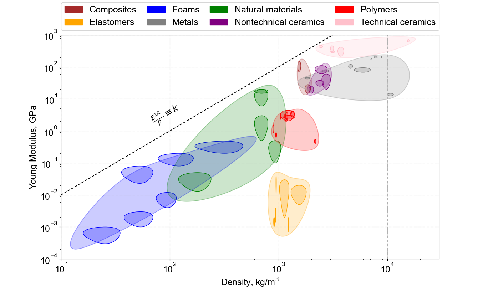

# Ashby Plotting
 Simple script to generate Ashby plots based on generic material property data. This package allows
 * creation of custom guidelines to define material indices (e.g., $\frac{E^{1/2}}{\rho}$),
 * plotting of discrete points (e.g., highlighting where Aluminum falls on a stiffness-density plot),
 * the ability to superimpose your own data on top of an Ashby plot (especially helpful for metamaterial work), and
 * a variety of quality-of-life plotting features to generate publication-worthy figures quickly. 

 Here's a sample Ashby plot generated by the package:

 ## Requirements

This package is compatible with Python 3.9 and above.
Here is a complete list of dependencies:

   * [matplotlib](https://matplotlib.org/)
   * [numpy](https://numpy.org/)
   * [pandas](https://pandas.pydata.org/)
   * [scikit-learn](https://scikit-learn.org/stable/)
   * [scipy](https://scipy.org/)

## Usage

* Material properties are stored in an `.xlsx` file in the `material_properties` directory. These properties are taken from the open-source [`material_database` repository](https://github.com/nicoguaro/material_database). If you'd like to include your own material database, add a similarly formatted xlsx file to the directory and change the `file_name` variable.  Two different sheets are distributed with this package:
   1.   `common_material_properties.xlsx` includes material property ranges for common materials. This is useful to plot ellipses. 
   2. `single_material_properties.xlsx` includes average properties for each material. 

* Specify the quantities for the x- and y-axes. **Note: These quantities are case-sensitive to match the .xslx file.**
* Specify your axes limits. 
* If you'd like to plot a material index guideline, set the `guideline_flag == True`. Then, modify the fields of the guideline dictionary to plot it in the desired location and with the correct annotation. Note that this step typically takes a bit of trial and error; any enhancements are welcome here. 
* Finally, if you'd like to plot individual materials on the figure, set the `individual_material_flag` to True and enter your properties as dictionary fields.
* Launch the script by running `plot_ashby.py` and generate your figure!

It is expected that the precise formatting will take some iteration, but hopefully you find this useful.

 ## License

 This package is distributed under the MIT License. 

